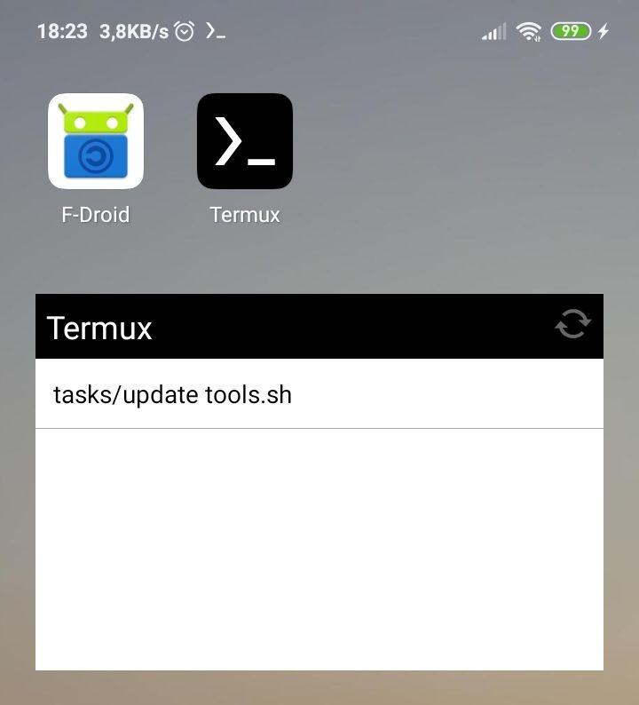

# termux-tools
> Useful tools for Termux


The repo make easy to using Termux thanks to useful scripts.




## Requirements

- [Termux](https://f-droid.org/en/packages/com.termux)
- [Termux Widget](https://f-droid.org/en/packages/com.termux.widget)
- [Termux API](https://f-droid.org/en/packages/com.termux.api)


## Installation

Termux:

```sh
cd $HOME
pkg install git
git clone https://github.com/bkayranci/termux-tools.git
cd termux-tools
make install
```


## Usage example

Scripts are run on Termux or [Termux:Widget](https://wiki.termux.com/wiki/Termux:Widget)

_For more examples and usage, please refer to the [Wiki](https://wiki.termux.com/wiki/Main_Page)._


## Development setup

Scripts are test when pushed in Github Actions by shellcheck.

[Shellcheck](https://www.shellcheck.net) can be used on web or installed.


## Meta

Türkalp Burak Kayrancıoğlu – [@bkayranci](https://twitter.com/bkayranci) – bkayranci@gmail.com

Distributed under the GNU GPLv3 license. See [``LICENSE``](./LICENSE) for more information.

[https://github.com/bkayranci/termux-tools](https://github.com/bkayranci/termux-tools)


## Contributing

1. Fork it (<https://github.com/bkayranci/termux-tools/fork>)
2. Create your feature branch (`git checkout -b feature/newScript`)
3. Commit your changes (`git commit -am 'Add a script'`)
4. Push to the branch (`git push origin feature/newScript`)
5. Create a new Pull Request
